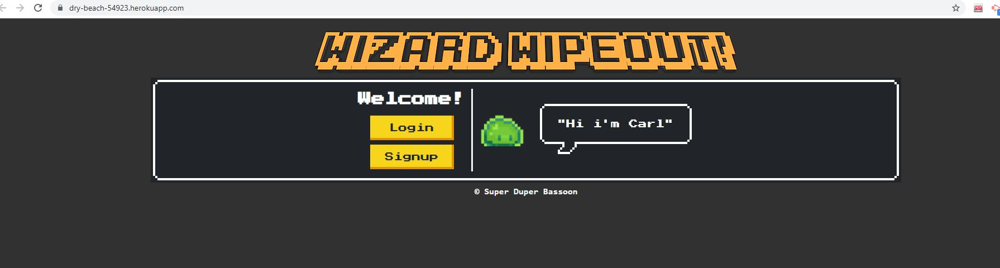
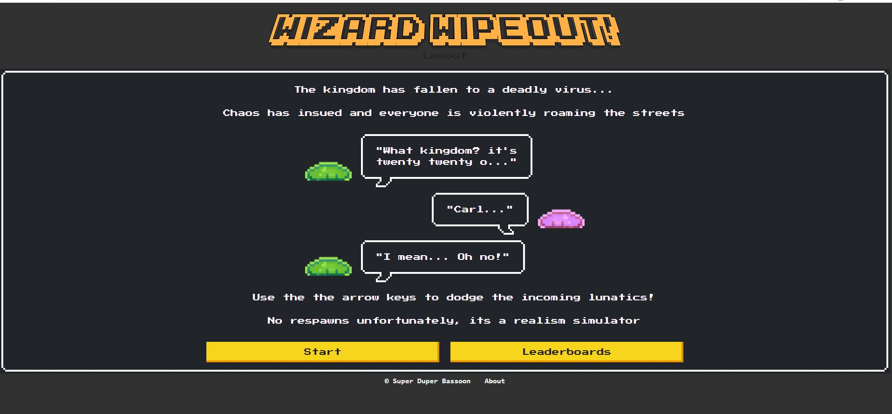

# RETRO-STYLE GAME 'WIZARD WIPEOUT!'
GROUP 4 - PROJECT 2

## Development Team
Mustafa Abdelrahman, Rachel Brain, Suva Pokharel & David Szamek

## License
[](https://opensource.org/licenses/MIT)

## Description
A retro-style, single-player game deployed on Heroku where a player takes on the guise of a wizard.  The player moves their avatar using the arrow keys to avoid their fast-moving enemies as a milli-second counter counts up.  The game ends when an enemy collides with the wizard avatar.  A high score achieved by the player will be added to a leaderboard page with the high scores from the top 5 players.

## Motivation
A fantastic opportunity to showcase our team's collaborative skills and coding abilities, we were motivated to build a fun retro-style, single-player game using a number of tools to develop a real-world full-stack application.

## User Story

```md
AS AN avid gamer who thrives on competition and fast-paced activities
I WANT a game which challenges me to survive waves of incoming enemies
SO THAT I can unwind after a long day of coding and have some fun!
```

## Acceptance Criteria

```md
GIVEN a retro-style game website
WHEN I visit the site for the first time
THEN I am presented with a Login/Register window
WHEN I log in or register
THEN I am presented with a Profile dashboard including some comic content and the rules of the game
WHEN I have finished reading the rules and am ready to start
THEN I press the “Start” button
WHEN I press “Start”
THEN I am taken to an old-school-styled game page with a milli-second countup which begins immediately
WHEN the count begins the enemies start their approach 
THEN I am able to control the movement of my avatar using the arrow keys
WHEN I continue to avoid the enemies  
THEN the countup continues and the enemies become more plentiful
WHEN an enemy collides with the avatar
THEN there is an explosion on the game screen
WHEN an explosion occurs 
THEN the countup stops and a message is shown saying that the game is over
AND the count becomes my final score
WHEN the game is over
THEN I am presented with my final score and a prompt asking if I would like to play again
WHEN I choose "yes"
THEN the game runs again
WHEN I choose "no"
THEN I am exited from the game
WHEN I exit from the game
THEN I see a leaderboard page with my score included with the high scores from the top 5 players
WHEN I visit the site for subsequent times
THEN I do not have to re-enter my login details as they are saved via cookies
```

## Screenshot




## Tools Used
The application uses:
- bcrypt
- dotenv
- express
- handlebars
- mysql2
- sequelize
- canvas html
- nes.css
- github
- heroku

## Usage
The game 'Wizard Wipeout!' website will be deployed on the Heroku webpage in the player's prefered browser.  After the player logs in or registers, they will be presented with a profile and rules page.  The player presses the "GO!" button when ready to play.

## Heroku URL
https://dry-beach-54923.herokuapp.com/

## GitHub Repo URL
https://github.com/rachel-brain/super-duper-bassoon

## Final Presentation Deck URL
https://docs.google.com/presentation/d/1emtTq05X124DPh5sFW1EhcV0u-fpspi3P3hAjQ3-DMw/edit#slide=id.ged8f6d7e59_0_1006

## Future Upgrades
- Addition of background music and sound effects
- New enemies and avatar selection
- Powerups and spellcasting
- Multiplayer functionality

## Contact
- https://github.com/engn-mustafa
- https://github.com/rachel-brain
- https://github.com/Sooova
- https://github.com/DavidSzamek